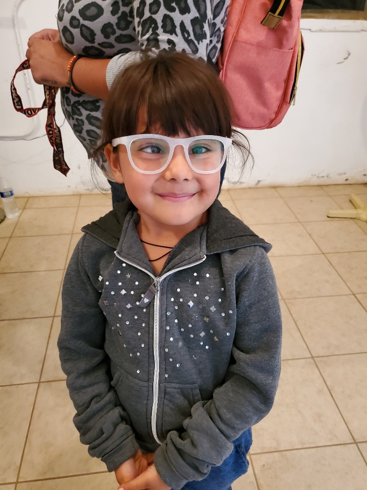
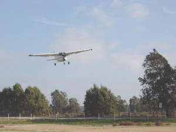

# Mission

{className="mt-4"} CALO is a charitable, Christian faith-based, all-volunteer flying outreach dedicated to meeting the medical, spiritual, and transportation needs of the poor and needy within the capabilities of our aircraft, resources, and the availability and skills of our volunteers.

Our Board members and many of our volunteers are Christian individuals who believe our Lord has directed us to be His hands and heart to all  we meet. We are blessed to be given the opportunity to serve others.  Our mission is to glorify our Lord with all we say and do personally and through our ministry of CALO.  The Word of God is very clear as to how we are expected to present ourselves and the manner in which we are to conduct our lives.  As we plan and execute our missions, we fully intend to obey His direction.

We welcome all volunteers to participate in our missions, but ask that everyone understands we request that all language, actions, and work be disciplined with the highest morality and integrity. Our mission leaders will be responsible for maintaining these standards on all outreach missions.

Our intended pattern of conduct for all CALO volunteers is well described by Colossians 3:12-14:

"As those who have been chosen of God, holy and beloved, put on as heart of compassion, kindness, humility, gentleness, and patience; bearing with one another, and forgiving each other, whoever has a complaint against anyone; just as the Lord forgave you, so also should you. And beyond all these things put on love, which is the perfect bond of unity. And let the peace of Christ rule in your hearts…and be thankful."

{className="float-img left child-img"}

CALO operates solely dependent upon the Lord’s provision, individual and corporate donations, volunteers, and the generosity of pilot/owners to offer their private aircraft for our outreach flights. We have no paid employees, and all planning and administrative tasks are handled by volunteers. We have been a Colorado non-profit corporation since September 28, 2000, operate in compliance with the Articles of Incorporation, and were granted IRS 501(c)(3) tax exempt status on October 12, 2001 Our capital assets include some surgery instruments and two older vans stored at the El Buen Pastor Hospital, San Quintin, Baja Norte, Mexico, used to transport our volunteers while on-site. We have no liabilities.

{className="float-img right"}

Ed von Delden, CALO’s Founder, began ministry flights to Baja in the late 1970’s as Harbor AirLift Outreach (HALO), a ministry of Harbor Christian Center in Los Angeles. In 1999, after relocating to Ridgway, CO, Mr. von Delden began CALO outreach flights involving family general practice, dental, chiropractic, and optometry care. In 2005 we focused our resources to eye care (optometry and ophthalmology) to meet the most critical need in the San Quintin Valley of Baja. Our organization volunteer roster has grown to approximately 70 volunteer doctors, technicians, pilots, and helpers throughout the southwestern states that join us whenever the need arises and their schedules will allow. In total, there are currently nine aircraft owner/pilots regularly available with several in reserve. Since 2005, our pilots have logged more than 30 weekend flights to serve approximately 3,000 patients with eye care at no charge.
