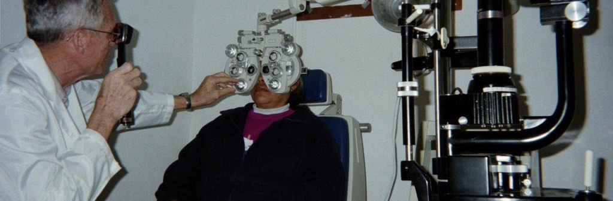

# What We Do

{className="wwd-img-1"}
{className="mt-4"}Our current mission emphasis includes Optometry and Ophthalmology Clinic weekends typically held from Thursday through Sunday on the fourth weekend in April and the third weekend in September, with exceptions to that exact schedule common, subject to weather and other unforeseen circumstances, at the El Buen Pastor Hospital, San Quintin, Baja, Mexico. See “Clinic Schedule” on this website for exact dates. During those weekends between 200 to 300 patients receive eye exams and glasses as needed, and many patients benefit from cataract removal and replacement lens implants. While patients and their children are waiting to be served, ministry teams comprised of CALO and Mission Flight (sister organization) volunteers, joined with local church members, present Christian-based testimonials and teachings in a respectful and non-pressured manner to offer enduring hope and encouragement beyond the physical help that the clinic may provide.

{className="wwd-img-2"}
Transportation is typically provided by volunteer pilots departing from airports in Western Colorado in privately-owned small aircraft for our four-day clinic weekends. Mission Flight owns several aircraft flown by qualified pilots typically used to transport Southern California-based volunteers.  Most of the day on Thursday and Sunday is needed to travel to and from the clinic which is located about one hour airtime south of the border. Accommodations include comfortable, clean, modern hotels, and team members enjoy meals at trusted local restaurants. Volunteers’ total costs for meals, accommodations, border crossing fees, and shared fuel are typically less than $600 for the weekend, depending on personal preferences, the point of departure, and the aircraft available.

We encourage you to browse our website for more information and welcome you to apply to join our next trip. Volunteers are encouraged to register for a specific clinic at least 60 days before the scheduled clinic date. However, departing on a specific clinic trip is dependent on receiving the necessary combination of team members to support the clinic, as well as favorable weather forecasts for the weekend. Trip cancelations are uncommon, but possible.

CALO works closely with Mission Flight (www.missionflight.org) headquartered in San Gabriel, CA.  Mission Flight handles clinic reservations for all volunteers, including those from Colorado, by contacting the website above.  Colorado volunteers that travel with CALO pilots will also be provided via email, release and pilot affirmation forms specific to CALO.

Mission Flight's role at the San Quintin eye clinics is increasing to eventually handle the majority of the responsibility for those clinics historically provided by CALO.  CALO will continue to support future clinics  by primarily transporting volunteers from Colorado and supporting some clinic costs.   Mission Flight also provides Christian faith-based dental and medical clinics to other locations in Mexico.  Please see their website for more information.
